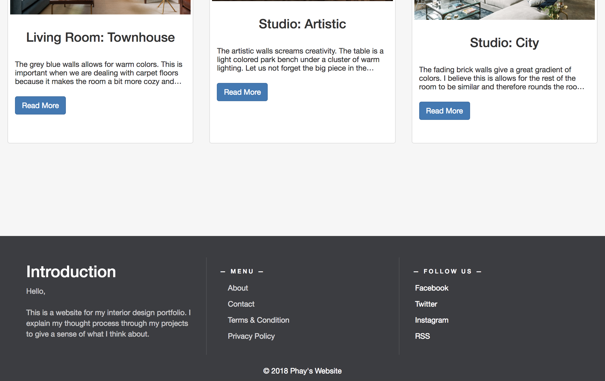

# open_project

This project is to use the Django Framework with React to display their artistic portfolios. 
I do not own the pictures, I just used them as a reference to give a sense of what it would look like.

## Homepage and Footer:
This footer is below every page, but one has to scroll there as to not be obtrusive.

          
This is currently the homepage, it displays the three most recent posts.

## Portfolio:
This is currently the Portfolio, it displays up to 5 a page. There are also tags in case users want to filter by interior design space.

## Posts:
This is currently the design of the posts. A jumbotron of the description of the picture after the picture and title. Tags are at the corner. Previous and next buttons allow users to travel without going back to the portfolio page or filtering again. When there are no more newer posts, next will disappear. When there are no more older posts, previous will disappear. Otherwise, both will appear.

## Contact:
This is a page to help those who visit to reach out to me.

## About:
This is the about me page.

