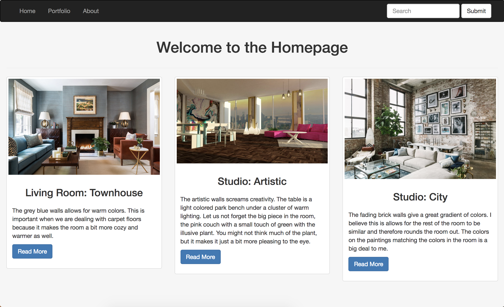
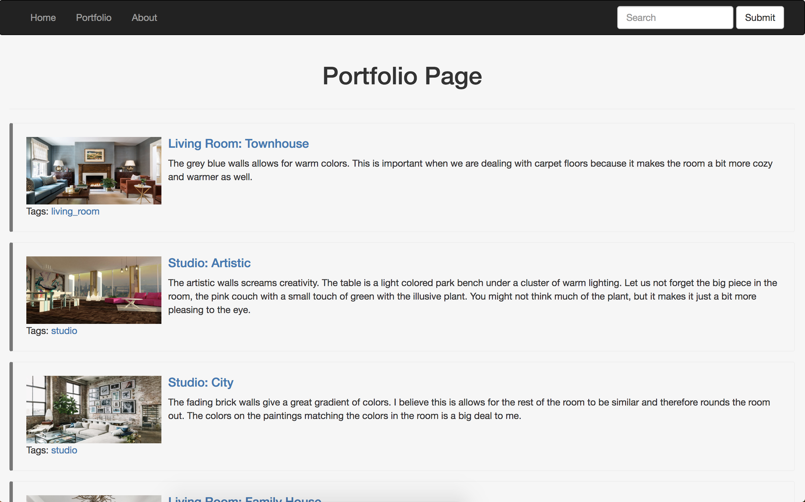

# open_project

This project is to use the Django Framework with React to help others display their artistic portfolios.

## Homepage:
This is currently the homepage, it displays the three most recent posts.

## Portfolio:
This is currently the Portfolio, it displays up to 5 a page. There are also tags in case users want to filter by interior design space.

## Posts:
THis is currently the design of the posts. A jumbotron of the description of the picture after the picture and title. Tags are at the corner. Previous and next buttons allow users to travel without going back to the portfolio page or filtering again. When there are no more newer posts, next will disappear. When there are no more older posts, previous will disappear. Otherwise, both will appear.

